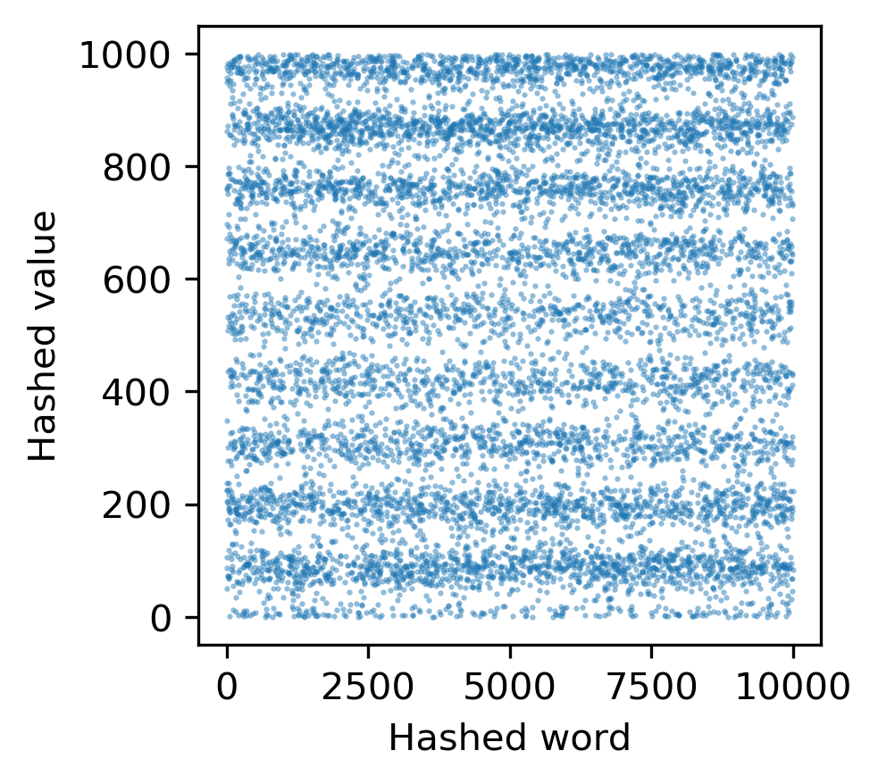
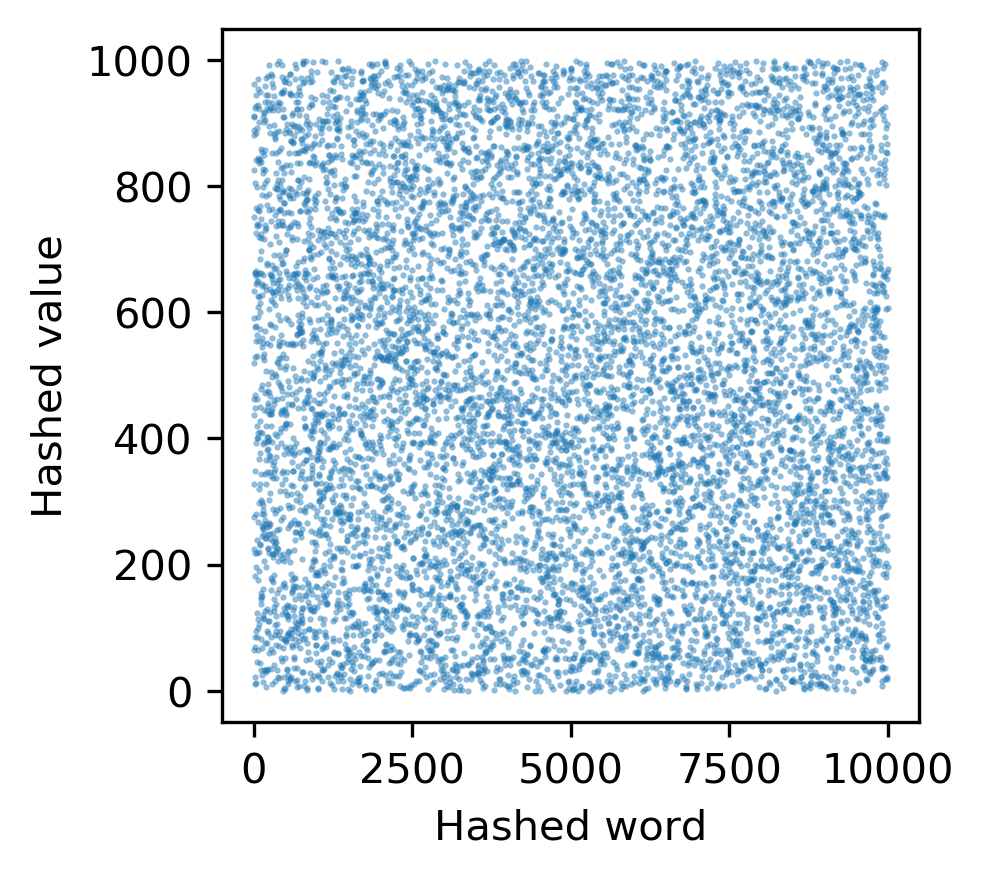

```
python hash_functions.py rand_words.txt ascii | python scatter.py ascii_hash_function.png "Hashed word" "Hashed value"
```



```
python hash_functions.py rand_words.txt rolling | python scatter.py rolling_hash_function_rand.png "Hashed word" "Hashed value"
```



```
for M in $( seq  1000 1000 10000 ); do
    python hash_table.py 10000 rolling linear rand_words.txt $M >  rolling_linear_rand.$M.txt
done

grep insert rolling_linear_rand.*.txt | cut -d " " -f2,3 | python scatter.py rolling_insert_time.png "Load factor" "Insert time"
```


