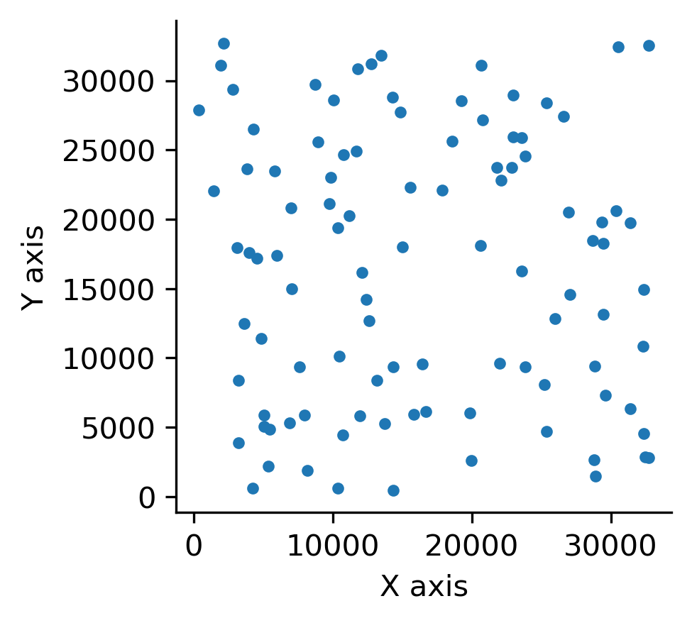
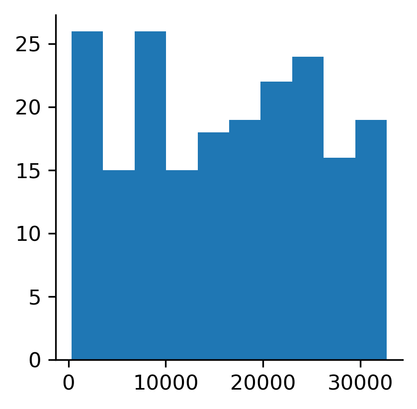
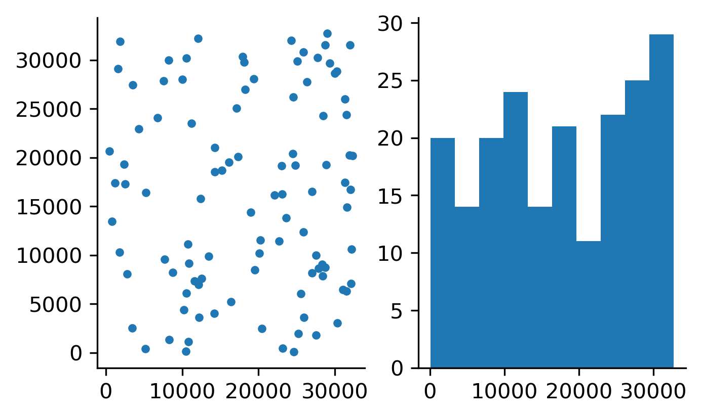
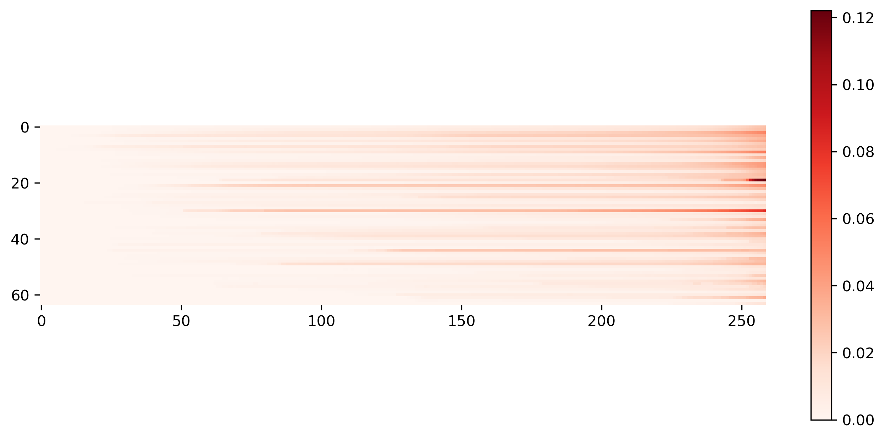

```
bash gen_data.sh | python scatter_plot.py
```

<center></center>

```
bash gen_data.sh | python hist_plot.py
```

<center></center>

```
bash gen_data.sh | python combo_plot.py
```

<center></center>

```
git clone https://github.com/nytimes/covid-19-data.git
wget https://www2.census.gov/programs-surveys/popest/datasets/2010-2019/counties/totals/co-est2019-alldata.csv
python imshow_plot.py \
    --out Colorado.png \
    --cases covid-19-data/us-counties.csv \
    --state Colorado \
    --population co-est2019-alldata.csv  \
    --height 5 \
    --width 11
```

<center></center>
